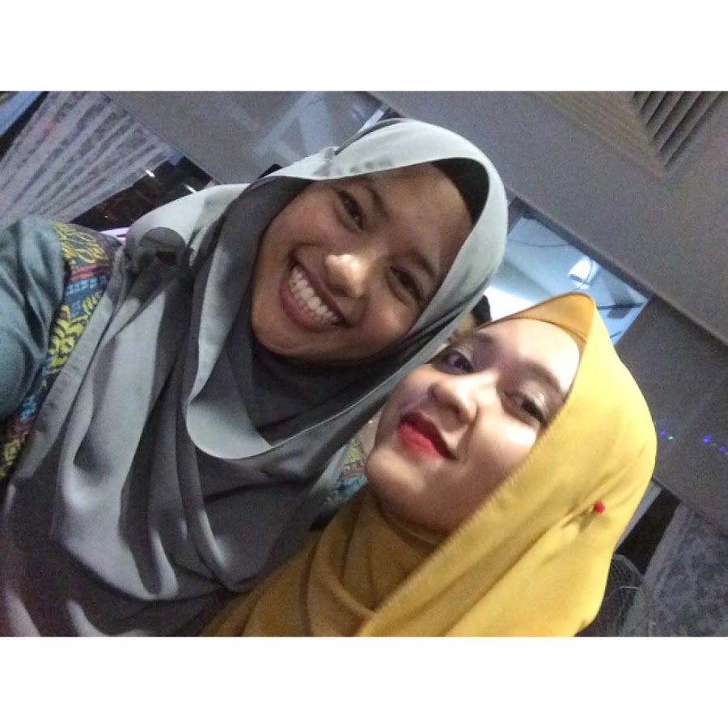
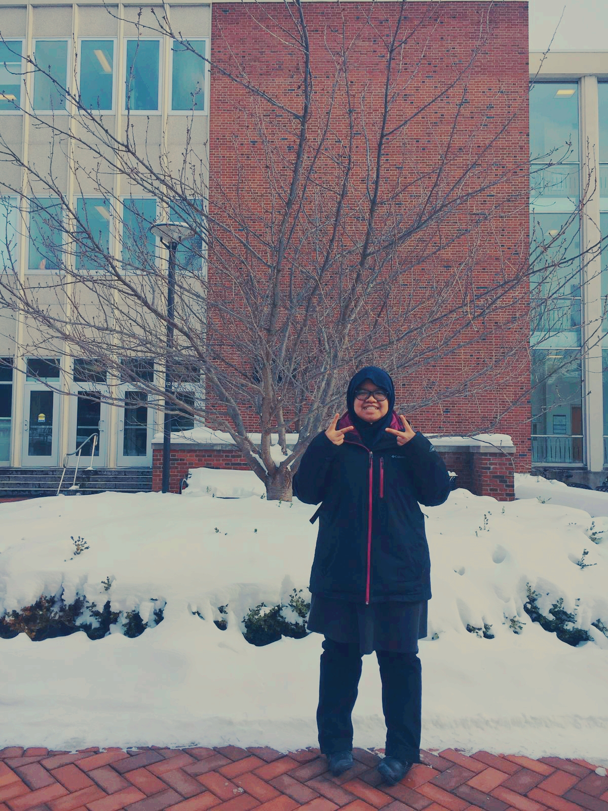
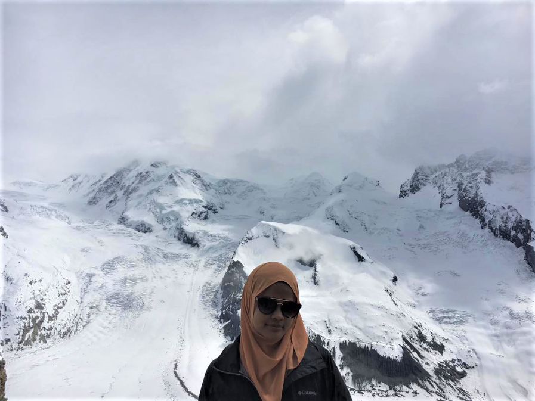
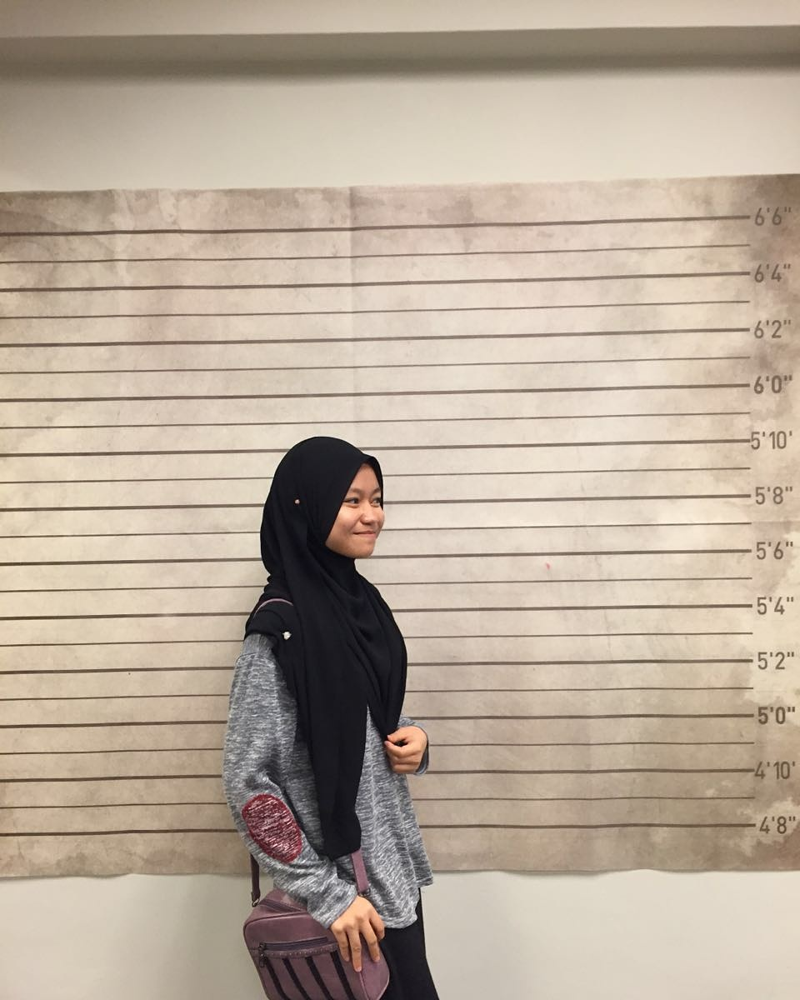

---
title: "Homework 1"

author: "Hanim Zul, Shafiqah Azman, Iffah Mohamad Saufi, Nurlisa Muhamad Fadli"

date: "September 8, 2017"

output: html_document

bibliography: ref.bib

---


**Summary**

The structure of this homework test group members and understanding and ability to use Rmarkdown and Github. Throughout this task, all members use Github as a medium to interact when there is no face-to-face meeting. Upon completing Homework 1, all group members are able to use Rmarkdown efficiently as we have to add video, built references and chunk of code in Rmarkdown and make it as a document.

#Introduction

<iframe width="560" height="315" src="  https://www.youtube.com/embed/3YUIy53QkmU" frameborder="0" allowfullscreen></iframe>


#Group Members


###Iffah Mohamad Saufi

<center>{width=50%}

The Pennsylvania State University | B.Sc of Statistics | Eberly College of Science | Class of 2020

</center>

  * Whenever I'm free, I will watch movies in my laptop. I spent a lot of my time with it and I also love                watching korean drama. Fun fact about me is I am the      8th of my 11th siblings. Also, I love doing outdoor        activities especially         hiking. 
  
  * **Favorite quote:**
  
  > Twenty years from now you will be more disappointed by the things that you didn't do than by the ones you did do. - *H.Jackson Brown Jr.* (1)
  
  * **Iffah's schedule for FALL 2017:**
  
+---+-----------------+-------------------+
|   |      Class      |        Time       |
+===+=================+===================+
| 1 |     STAT 297    |     1205-0110     |
|   |                 |    Tue & Thurs    |
+---+-----------------+-------------------+
| 2 |     MATH 230    |     0440-0530     |
|   |                 | Mon,Wed,Thurs,Fri |
+---+-----------------+-------------------+
| 3 |      RM 302     |     0905-0955     |
|   |                 |    Mon,Wed,Fri    |
+---+-----------------+-------------------+
| 4 |     BiSc 003    |     1010-1100     |
|   |                 |    Mon,Wed,Fri    |
+---+-----------------+-------------------+
| 5 |     RSLT 107    |     0305-0420     |
|   |                 |    Tue & Thurs    |
+---+-----------------+-------------------+
  
###Shafiqah Azman

<center>

{width=50%}


The Pennsylvania State University | B.Sc of Mathematics | Minor in Statistics |
Eberly College of Science | Class of 2017 | Member of Mu Sigma Rho | National Statistics Honor Society

</center>


  * I'm a homebody so I spend most of my time at home. I usually watch dramas with     genre law, medical, thriller      and suspense. I also like to learn new languages     and currently I'm learning Korean language. Even though I'm     a homebody , I also enjoy get-together with my close friends either going out to eat or          attending           any events
  * **Favorite quote:** 
  
  > Happiness is found when you stop comparing yourself to other people -*Unknown*
  
  * **Shafiqah's schedule for FALL 2017:**

+---+-----------------+-------------------+
|   |      Class      |        Time       |
+===+=================+===================+
| 1 |     STAT 297    |     1205-0120     |
|   |                 |    Tue & Thurs    |
+---+-----------------+-------------------+
| 2 |    CMPSC 451    |     1115-1205     |
|   |                 |    Mon,Wed,Fri    |
+---+-----------------+-------------------+
| 3 |     STAT 461    |     0125-0215     |
|   |                 |    Mon,Wed,Fri    |
+---+-----------------+-------------------+
| 4 |      KOR 3      |     0230-0320     |
|   |                 |    Mon,Wed,Fri    |
+---+-----------------+-------------------+
| 5 |     MATH 484    |     1035-1150     |
|   |                 |    Tue & Thurs    |
+---+-----------------+-------------------+


###Khadijah Hanim Zulhaimi

<center>{width=50%}


The Pennsylvania State University | B.Sc of Mathematics | Minor in Statistics |
Eberly College of Science | Class of 2018

</center>

  * People normally called me Hanim, the way to say it is like Honey with "m" at the back. My hobby I guess is the same as my generation,which is surfing internet. I love(a lot) listening to music and do some arts-y stuff or sport at the same time. However, I endorsed sleeping the most. Fun fact about me is I named my guitar "Usop", and treat him like my boyfriend. Oh, and I also run an online business.

 * **Favorite quote:** 
    
  > Be not afraid of greatness. Some are born great, some achieve greatness, and some have greatness thrust upon 'em.-*William Shakespeare*
  
  * **Hanim's schedule for FALL 2017:**
  
+---+-----------------+-------------------+
|   |      Class      |        Time       |
+===+=================+===================+
| 1 |     STAT 461    |     0905-0955     |
|   |                 |    Mon,Wed,Fri    |
+---+-----------------+-------------------+
| 2 |     ARAB 001    |     1010-1100     |
|   |                 |    Mon,Wed,Fri    |
+---+-----------------+-------------------+
| 3 |     MATH 312    |     0125-0215     |
|   |                 |    Mon,Wed,Fri    |
+---+-----------------+-------------------+
| 4 |     MATH 436    |     0230-0320     |
|   |                 |    Mon,Wed,Fri    |
+---+-----------------+-------------------+
| 5 |     MATH 484    |     1035-1150     |
|   |                 |    Tue & Thurs    |
+---+-----------------+-------------------+
| 6 |     STAT 297    |     1205-0120     |
|   |                 |    Tue & Thurs    |
+---+-----------------+-------------------+

###Nurlisa Muhamad Fadli

<center>{width=50%}

The Pennsylvania State University | B.Sc of Statistics |  Eberly College of Science | Class of 2017
</center>

* I loved reading so much. There is no reason not to love reading except the material you are reading is cliche or     something you are not interested in. I often find myself reading something related to human body such as 'Human      Atlas' or 'Fruits and Their Benefit'. It makes me understand how our body, a complex system works. 
    This makes me doubt myself for choosing Actuarial Science for my major Hahaha. Fun fact about me is that I hate      beaches. dont take me wrong; i love the scenery but i hate laying there doing nothing.
  * **Favorite quote:** 
  
  > Be yourself; everyone else is already taken. -*Oscar Wilde*
  
  * **Nurlisa's schedule for FALL 2017:**

+---+-----------------+-------------------+
|   |      Class      |        Time       |
+===+=================+===================+
| 1 |     STAT 297    |     1205-0110     |
|   |                 |    Tue & Thurs    |
+---+-----------------+-------------------+
| 2 |     MATH 230    |     0440-0530     |
|   |                 | Mon,Wed,Thurs,Fri |
+---+-----------------+-------------------+
| 3 |      RM 302     |     0905-0955     |
|   |                 |    Mon,Wed,Fri    |
+---+-----------------+-------------------+
| 4 |     RSLT 107    |     0305-0420     |
|   |                 |    Tue & Thurs    |
+---+-----------------+-------------------+

#R Markdown Syntax

##ii)
```{r}
x=rnorm(100, 0, 1)
```

```{r}
A=median(x)
B=mean(x)
C=var(x)
```

Empirical median of x is `r A`. 

Empirical mean of x is `r B`. 

Empirical variance of x is `r C`

The empirical value of median, mean and variance of x are different from 0, 0 and 1.

This result is not surprising as x is randomly generated from the standard normal distribution and hence the values of x are different from the standard normal distribution.

```{r}
hist(x,  main = paste("Histogram of 100 random samples from a standard normal distribution" ))
```


The histogram of x is approximately symmetrical with bell-shaped. This histogram has similar shape as the histogram of a standard normal distribution with mean=0 and standard deviation=1.


$$
\begin{aligned}
\mathbb{E} [\mathrm{var}\{ v_1(\hat \theta, n) \}] &=  \mathrm{var}\{ v_1( \theta_0, n)\} 
+ \mathbb{E} [\ \mathcal{O} _p \{ \mathbf{D}_1 (\theta^*, n)(\hat \theta- \theta_0), ...,
\mathbf{D}_p (\theta^*, n)(\hat \theta- \theta_0) \}] \\
&=\mathrm{var}\{ v_1( \theta_0, n)\} + \mathcal{O} (n^{-2})
\end{aligned}
$$

$\boldsymbol A \equiv [a_{i,j}]_{i,j=1,...,p^.}$

Colored text: <span style="color:blue">“Vérité dans un temps, erreur dans un autre.”, Charles de Montesquieu</span>.

<button data-toggle="collapse" data-target="#SessionInfo">More info</button> <div id="SessionInfo" class="collapse"> Hey there! For your information, you are awesome! </div>


<span style="background-color:yellow">**CAUTION: Might cause cringe.**
</span>


###References

(1) @Nelson2000 

https://stackoverflow.com/questions/30610555/hide-shiny-output#comment79373058_30610977