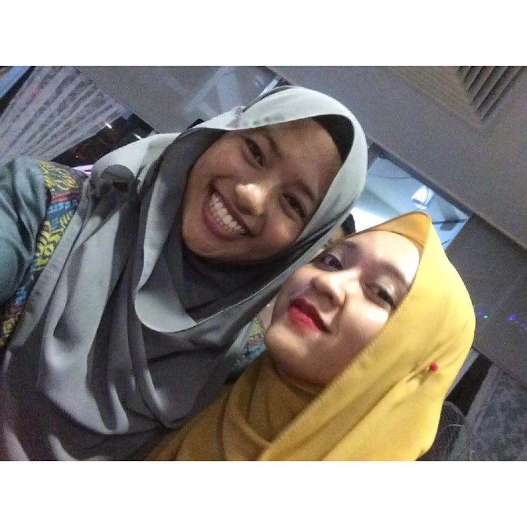
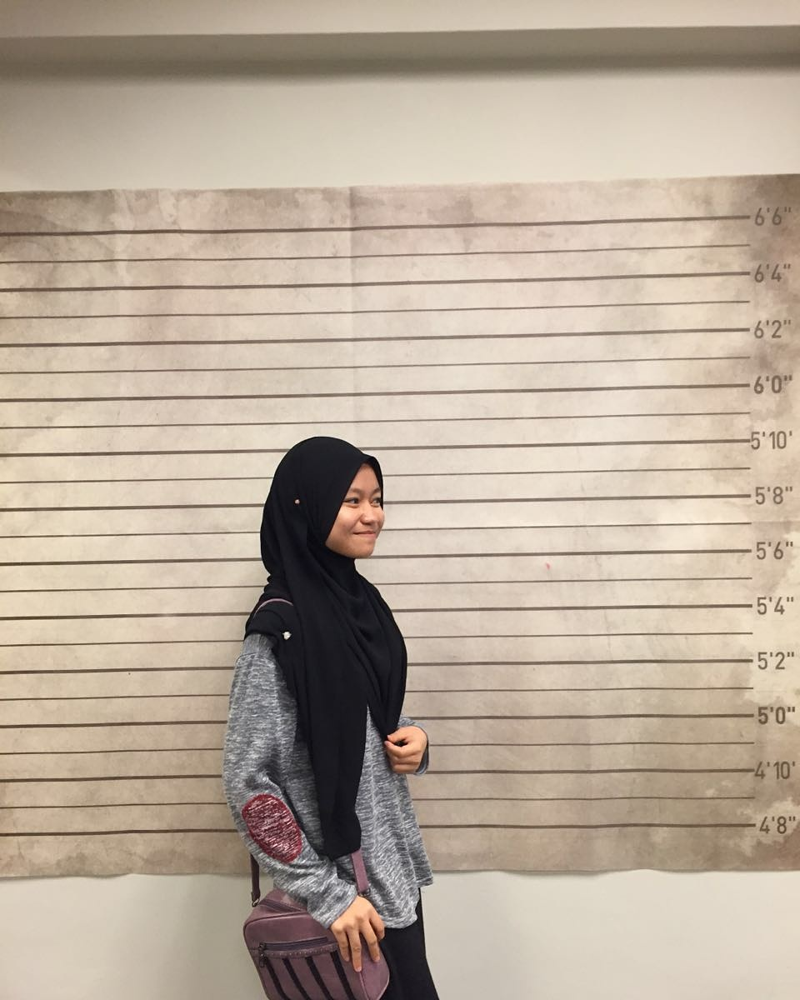

#**GROUP MEMBERS**

###Iffah Mohamad Saufi 

{width=30%}

  * Whenever I'm free, I will watch movies in my laptop. I spent a lot of my time with it and I also love                watching korean drama. Fun fact about me is I am the      8th of my 11th siblings. Also, I love doing outdoor        activities especially         hiiking. 
  
  * **Favorite quote:**
  
  > Twenty years from now you will be more disappointed by the things that you didn't do than by the ones you did do. - H.Jackson Brown Jr.
  
  * **This is Iffah's schedule for FALL 2017:**
  
+---+-----------------+-------------------+
|   |      Class      |        Time       |
+===+=================+===================+
| 1 |     STAT 297    |     1205-0110     |
|   |                 |    Tue & Thurs    |
+---+-----------------+-------------------+
| 2 |     MATH 230    |     0440-0530     |
|   |                 | Mon,Wed,Thurs,Fri |
+---+-----------------+-------------------+
| 3 |      RM 302     |     0905-0955     |
|   |                 |    Mon,Wed,Fri    |
+---+-----------------+-------------------+
| 4 |     BiSc 003    |     1010-1100     |
|   |                 |    Mon,Wed,Fri    |
+---+-----------------+-------------------+
| 5 |     RSLT 107    |     0305-0420     |
|   |                 |    Tue & Thurs    |
+---+-----------------+-------------------+
  

###Shafiqah Azman

{width=30%}

  * I'm a homebody so I spend most of my time at home. I usually watch dramas with     genre law, medical, thriller      and suspense. I also like to learn new languages     and currently I'm learning Korean language. Even though I'm     a homebody , I also enjoy get-together with my close friends either going out to eat or          attending           any events
  * **Favorite quote:** 
  
  > Happiness is found when you stop comparing yourself to other     people 
  
  * **This is Syafiqah's schedule for FALL 2017:**

+---+-----------------+-------------------+
|   |      Class      |        Time       |
+===+=================+===================+
| 1 |     STAT 297    |     1205-0120     |
|   |                 |    Tue & Thurs    |
+---+-----------------+-------------------+
| 2 |    CMPSC 451    |     1115-1205     |
|   |                 |    Mon,Wed,Fri    |
+---+-----------------+-------------------+
| 3 |     STAT 461    |     0125-0215     |
|   |                 |    Mon,Wed,Fri    |
+---+-----------------+-------------------+
| 4 |      KOR 3      |     0230-0320     |
|   |                 |    Mon,Wed,Fri    |
+---+-----------------+-------------------+
| 5 |     MATH 484    |     1035-1150     |
|   |                 |    Tue & Thurs    |
+---+-----------------+-------------------+

###Khadijah Hanim Zulhaimi

{width=30%}

  * My name is Khadijah Hanim Zulhaimi. People normally called me Hanim. My hobbies are surfing internet, listen to     music, and read fictional books. Fun fact 

###Nurlisa Muhamad Fadli

{width=30%}

  * I loved reading so much. There is no reason not to love reading except the material you are reading is cliche or     something you are not interested in. I often find myself reading something related to human body such as 'Human      Atlas' or 'Fruits and Their Benefit'. It makes me understand how our body, a complex system works. 
    This makes me doubt myself for choosing Actuarial Science for my major Hahaha. Fun fact about me is that I hate      beaches. dont take me wrong; i love the scenery but i hate laying there doing nothing.
  * **Favorite quote:** 
  
  > Be yourself; everyone else is already taken.
  
  * **This is Nurlisa's schedule for FALL 2017:**

+---+-----------------+-------------------+
|   |      Class      |        Time       |
+===+=================+===================+
| 1 |     STAT 297    |     1205-0110     |
|   |                 |    Tue & Thurs    |
+---+-----------------+-------------------+
| 2 |     MATH 230    |     0440-0530     |
|   |                 | Mon,Wed,Thurs,Fri |
+---+-----------------+-------------------+
| 3 |      RM 302     |     0905-0955     |
|   |                 |    Mon,Wed,Fri    |
+---+-----------------+-------------------+
| 4 |     RSLT 107    |     0305-0420     |
|   |                 |    Tue & Thurs    |
+---+-----------------+-------------------+

